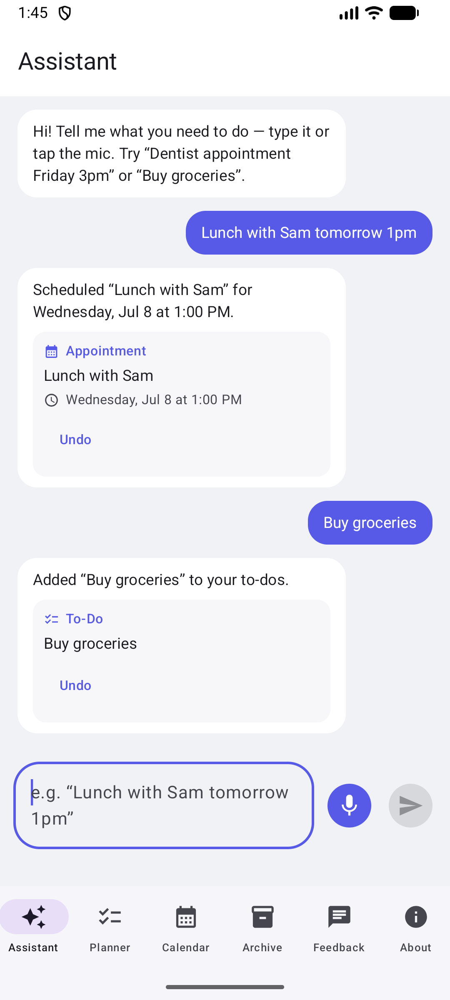
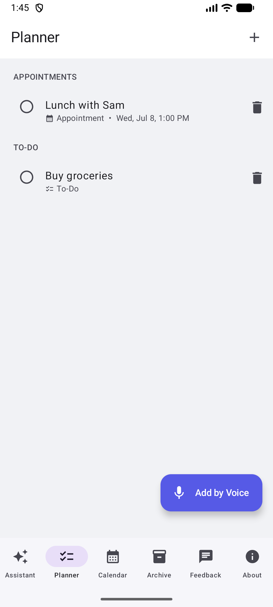
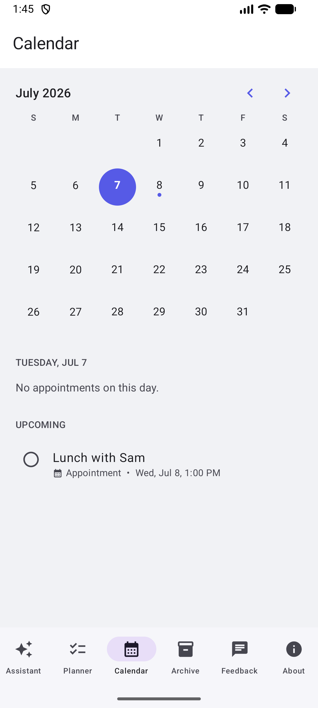
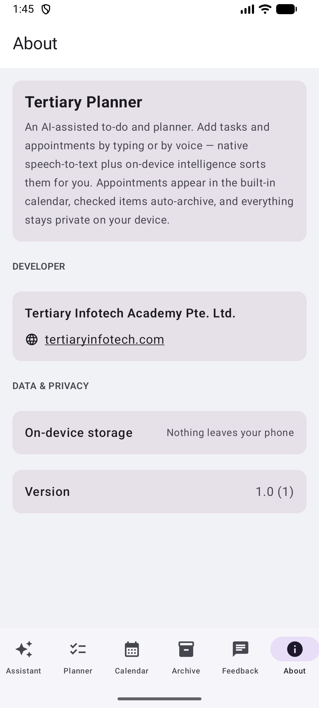

# Tertiary Planner — AI To-Do & Planner for Android

A native Android app for managing **to-dos and appointments by voice or touch**. Speak
naturally — *"Lunch with Sam tomorrow at 1pm"* — and on-device intelligence turns it into a
scheduled appointment; *"Buy groceries"* becomes a to-do. Appointments appear in a built-in
calendar and checked items auto-archive. Everything stays private on your device.

This is the Android mirror of the
[Tertiary Planner iOS app](https://apps.apple.com/app/tertiary-planner/id6785397240),
rebuilt natively with Jetpack Compose and Material 3.

<p align="center">
  
  
  
  
</p>

## Features

- 💬 **Assistant chat** — the app's front door: tell the assistant what you need, by text or
  voice, and it drafts a nicely worded to-do or appointment and saves it instantly (with undo).
- ✅ **To-dos & appointments in one list** — add either from a single, smart form.
- ✏️ **Tap to edit** — tap any item in the Planner or Calendar to change its title, notes,
  type, or date in the same form used to create it.
- 🎙️ **Voice capture** — tap the mic, speak, and native Android speech-to-text transcribes it.
- 🧠 **On-device "AI" parsing** — detects dates/times ("tomorrow 1pm", "friday 3pm",
  "12 july"), classifies task vs. appointment, and cleans up the title automatically
  (no network, fully private).
- 📅 **Built-in calendar** — appointments show on a month calendar with a dot per busy day,
  a per-day list, and the next five upcoming appointments.
- 📥 **Auto-archive** — checking off an item moves it to the Archive automatically; uncheck
  to restore, or clear the archive in one tap.
- 💬 **Feedback & About** — house-style tabs (WhatsApp feedback, developer info, version).
- 🌙 **Dark mode** — full Material 3 theming with the brand indigo palette.

## Tech Stack


- **UI:** Jetpack Compose, Material 3, bottom navigation, adaptive light/dark color schemes.
- **Persistence:** Room (SQLite) with Kotlin Flows — on-device only.
- **Voice:** platform `SpeechRecognizer` with live partial transcripts; the recognizer is
  created lazily so no microphone prompt appears until dictation is actually used.
- **Intelligence:** `IntentAssistant` + `SmartParser` — a deterministic natural-language
  date/time detector and task/appointment classifier. Clock math never hallucinates.
- **Build:** Gradle version catalog, KSP for Room, R8 minified release, signed AAB.

## Architecture

```
app/src/main/java/com/tertiaryinfotech/plannerapp/
├── MainActivity.kt              — single-activity Compose host
├── PlannerViewModel.kt          — app-wide store (Room ↔ Compose state)
├── data/    PlannerItem.kt      — Room entity (task | appointment)
│            PlannerDatabase.kt  — DAO + database
├── logic/   SmartParser.kt      — deterministic date/time + intent parsing
│            IntentAssistant.kt  — drafts entries + friendly confirmations
├── speech/  SpeechRecognizerManager.kt — native speech-to-text wrapper
└── ui/      RootScreen (6 tabs), AssistantScreen, PlannerScreen, CalendarScreen,
             ArchiveScreen, FeedbackScreen, AboutScreen, AddItemSheet,
             VoiceCaptureSheet, Components, theme/Theme.kt
```

## Getting Started

```bash
# Requirements: JDK 17, Android SDK (compileSdk 36)
./gradlew :app:assembleDebug          # debug APK
./gradlew :app:bundleRelease          # signed release AAB (needs keystore.properties)
```

Open the project in Android Studio and run on any device/emulator with API 24+.

Release signing reads `keystore.properties` (git-ignored):

```properties
storeFile=../keystore/plannerapp-release.jks
storePassword=…
keyAlias=plannerapp
keyPassword=…
```

## Store Assets

`store/` holds the Play Store listing assets: 512×512 icon, 1024×500 feature graphic, and
phone screenshots captured from the emulator.

## Developer

**Tertiary Infotech Academy Pte. Ltd.** — [tertiaryinfotech.com](https://www.tertiaryinfotech.com)

## Acknowledgements

- Mirrors the [Tertiary Planner iOS app](https://apps.apple.com/app/tertiary-planner/id6785397240) feature-for-feature.
- Built with [Jetpack Compose](https://developer.android.com/jetpack/compose) and
  [Material Design 3](https://m3.material.io/).
